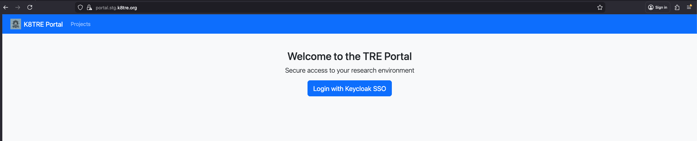
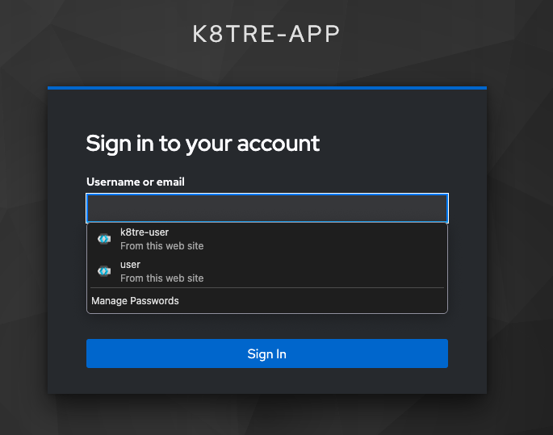
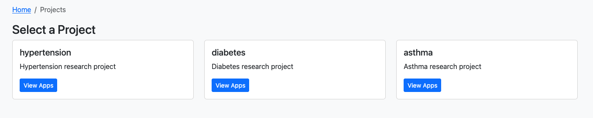
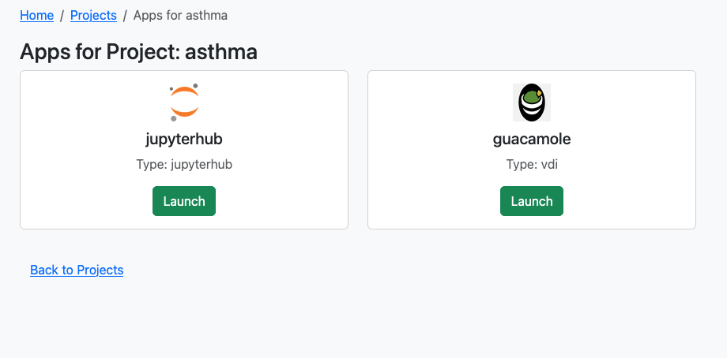
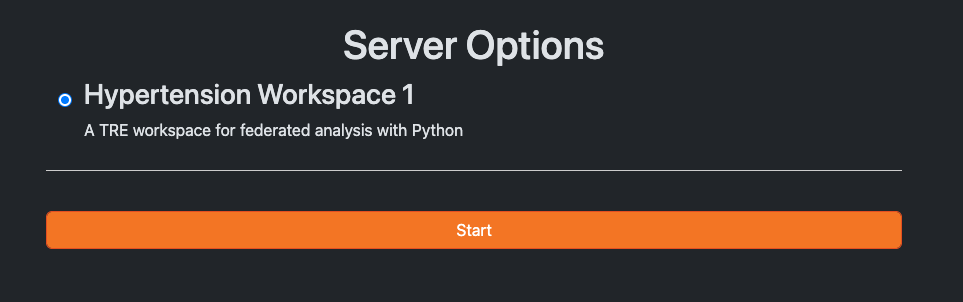
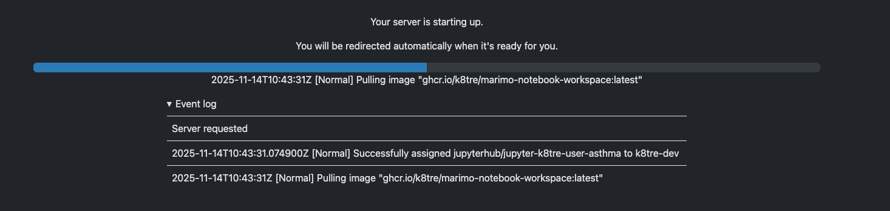
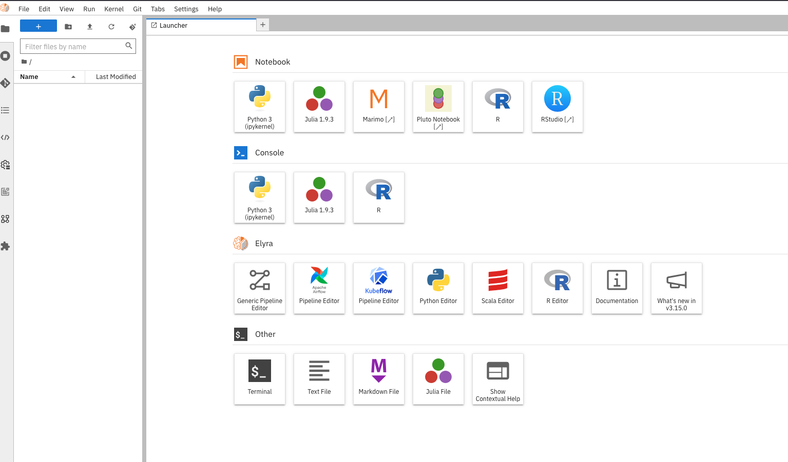

# K8TRE Workspace Access
This is a follow-on guide from the [K8TRE Installation](installation.md) walkthrough, demonstrating the steps required to access a K8TRE analytics workspace.

## Portal Access
K8TRE includes a user 'projects' portal service that authorised researchers/users can access via a browser to view, manage and access secure resources (i.e workspaces) associated witha project. With K8TRE running locally, open your host browser and access the portal:

!!! note
    The `external-domain` label value specified as your chosen domain zone must be specified in the service URLs described below. This guide assumes k8tre.org was specified as the domain zone. Change `k8tre.org` in the URLs below to the domain zone name you specified. In addition, change the environment subdomain (i.e. `dev`, `stg`) based on the environment cluster label specified.

```shell
https://portal.stg.k8tre.org/
```
As we are using selfsigned TLS certificates for this local deployment, access any warning messages in the browser.


Login to the portal by selecting the 'Login with Keycloak SSO' button. This will redirect you to K8TRE's identity management service (Keycloak).



Enter the credentials:


```shell
username: trevolution
password: k8tre
```
This will redirect you back to the Portal.


## User Projects

Select the view Projects button. You should see three pre-generated projects associated with this user account.



Select 'View Apps' to see the available 'applications' the user is authorised to operate against the chosen project.



## Launch K8TRE Workspace

To open the project with a analytics-orientated workspace (e.g. jupyterhub), select the 'Launch' button. At this point, K8TRE will begin to provision the workspace container and provide controlled access to the jupyterhub and available development libraries. Ensure to click 'Start' to confirm the workspace set up process:



Depending on the size of the workspace image this can take 1 to 5 minutes to complete on first loading. You should see a loading page similar to:



When loaded you will see the jupyter launcher pane:


