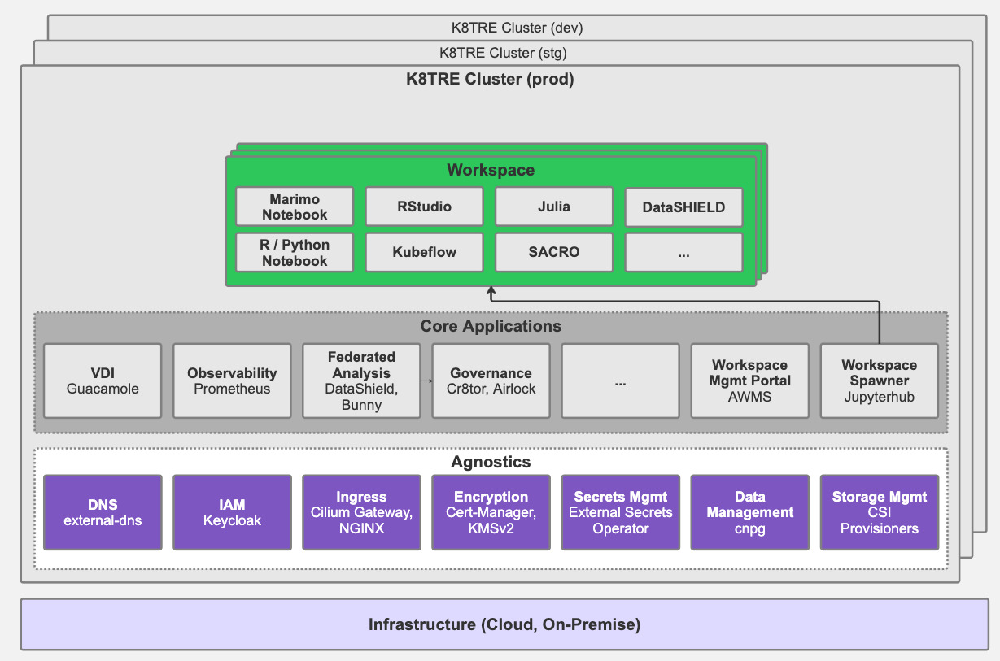

# K8TRE Architecture

K8TRE reference implementation will be deployable to [Azure Kubernetes Service](https://azure.microsoft.com/en-us/products/kubernetes-service), [Amazon Elastic Kubernetes Service](https://aws.amazon.com/eks/) and to [K3S](https://k3s.io/) on on-prem infrastructure (eg. on baremetal or VM-based environments). 

This is achieved through a three-layered architecture depicted in the architecture diagram below.

## Infrastructure Layer

The infrastructure layer provides everything that is required to support a CNCF-certified Kubernetes cluster for production workloads as well as the cluster itself. Some of the components in this layer would include:

- Networking: VNETs, SNETs, NSGs, Firewalls, DNS, Load balancers
- Identity management for IaaS/PaaS (eg. Entra for Azure); This is distinct from identity management within K8TRE itself
- Storage provision: eg. Longhorn or NFS for on-prem deployments, Azure Disk, File Share or Blob for AKS, etc.
- Infrastructure monitoring tools (eg. Proxmox monitoring, Azure Log Analytics)
- Secrets management (Azure Key vault, AWS Secrets manager)
- One or more Kubernetes clusters (K3s, AKS, EKS) with Cilium as the CNI and ArgoCD for GitOps

### Networking

K8TRE requires **Cilium** as the default CNI with Layer 7 routing and Gateway API support enabled. Target K8TRE clusters must meet these base networking requirements prior to deploying K8TRE. For example, K3S must be started with the flannel-backend turned off. For AKS on Azure, out-of-the-box managed Cilium CNI is constrained by charges for advanced features such as L7 routing support. To overcome this constraint, the reference implementation of an Azure infrastructure for K8TRE [here](https://github.com/k8tre/k8tre-azure) implements a BYO Cilium CNI approach that is configured to replace the default in-cluster kube-proxy service. In addition, Cilium is configured to handle IP address management using the cluster-pool mode to support high performance cluster networking.    

### Deployment Support
The current MVP follows a GitOps model for the deployment of K8TRE into a target cluster(s). In particular, it requires a **ArgoCD** management cluster is set up that is configured to listen on the repository where an TRE operators K8TRE repository is managed from and establish trusted connections to the k8s clusters where K8TRE is to be deployed. See [here](argocd.md) for more details.
For example, the K8TRE Azure infrastructure reference implementation provisions a separate management cluster configured with ArgoCD and trusted connections to target K8TRE clusters (i.e. dev, stg, prod).

### K8TRE Infrastructure Recipes
To support deployment of K8TRE, the development team aim to make available reference IaC implementations of base resources required to support the operation of K8TRE across a variety of cloud and on-premise settings:

#### Azure (AKS)
The K8TRE-Azure infrastructure reference implementation is an [IaC project](https://github.com/k8tre/k8tre-azure) developed in Terragrunt that provisions key resources within a hub-spoke network and environment landing zone that includes multiple AKS clusters with key customisations (i.e. BYO Cilium CNI), storage accounts, key vaults, etc. Moreover, the projects relies on the use of Azure Verified Modules (AVMs) wherever possible and follows best practice guidelines. It also includes CICD workflows implemented as Github Actions to demonstrate how to deploy the project via a runner hosted within the Azure tenant. 

#### On-Premise (K3s)
???

While these K8TRE infrastructure reference implementations aim to get operators up and running with minimal overhead, host organisations are free to setup their own infrastructre as long as it meets the requirements for K8TRE (and follows security best practices outlined by the SATREv2 specifications).

## Agnostics Layer

This layer provides the necessary abstractions and common components that will allow the application layer to operate regardless of where K8TRE is deployed.
The agnostics layer includes base components that provide core capabilities defined in the K8TRE specification:
- Encryption
    - certs-manager
    - KMSv2
- Identity & Authorisation Management
    - Keycloak
- DNS
    - external-dns
- Secrets Management
    - External secrets operator
- Ingress Management
    - Cilium Gateway
- Storage
    - CSI Provisioners
    - cnpg

See [agnostics documentation](agnostics.md) for more information. 

## Application Layer

Finally, there is the application layer where the actual microservices that provide user facing functions are deployed. These include identity management (KeyCloak), workspace provisioning (JupyterHub), federation tools and more.

## Developer Support & Environment Promotion

Environment promotion between dev/stg/prod environments is currently achieved by simply promoting directory changes through `dev` --> `stg` --> `prod` and letting ArgoCD to automatically deploy these to the correct clusters. 

!!! warning "To be documented/implemented"
    
    - Git branching strategy for ArgoCD
    - Production code resides in the `main` branch
    - Developers should be able to switch selected apps or clusters to a feature branch
    - Use ArgoCD projects to restrict developer access to only certain applications
    
